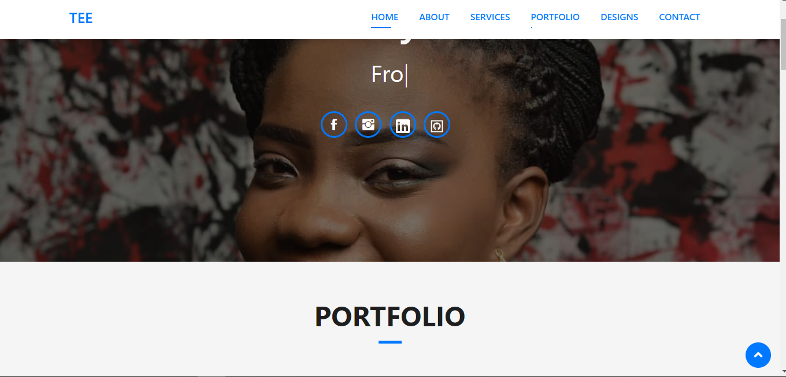

# My Portfolio

# Screenshot


# Built With
- JavaScript 
- HTML 
- CSS
- Bootstrap

**To get this project set up on your local machine, follow these simple steps:**

1. Open Terminal.
2. Navigate to your desired location to download the contents of this repository.
3. Copy and paste the following code into the Terminal: git clone https://github.com/Arinpe/My_Portfolio
4. Run ```cd Portfolio``.


live demo link: 

## Author Details:

👤 **Adesuyi Adetola**

- Github: [@Arinpe](https://github.com/Arinpe/My_Portfolio)
- Linkedin: [@Adesuyi Adetola](https://www.linkedin.com/in/aadetola/)
- E-mail: <a href="mailto:dehtolah@gmail.com?subject=Hello Adetola!">Email</a>  

[Live Demo]()

## Show your support

Give ⭐ Star me on GitHub — it helps!

## 📝 License

This project is [MIT](lic.url) licensed.   
